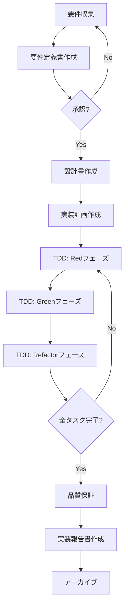

# Development Workflow

## 概念的ワークフロー

### 1. 準備フェーズ

**マスタープラン → 調査 (95%) → 要件 → 設計 → 実装計画**

1. **マスタープラン分析**: `@planning/master_plan.md` & `master_requirement.md` をレビュー（存在する場合）
2. **コード調査**: 95%の理解を得るまで調査
3. **要件**: 何を作るかを定義 (`@planning/current/requirement.md`)
4. **設計**: 95%の理解後にどう作るかを定義 (`@planning/current/design.md`)
5. **実装計画**: タスクチェックボックス (`@planning/current/task.md`)

### 2. 実装フェーズ

**TDDサイクル**: Red → Green → Refactor
- task.md の項目を分解 → TodoWrite → 実装 → チェックボックス更新

### 3. 完了フェーズ

**QA & ドキュメント化**
- テスト、リンター実行
- レポート作成 (`@planning/current/report.md`)
- 4つのドキュメントをアーカイブ

## 重要な原則

- **95% 理解ルール**: 95%の理解と自信なしに進まない
- **厳格な4ドキュメントシステム**: すべての開発がこのシステムに従う
- **@ 記法参照**: ドキュメント間のリンケージを維持
- **TodoWrite統合**: task.md の項目を具体的な作業に分解

## 実装プロセス詳細

### ステップ1: 要件収集と定義

#### 入力
- ユーザーからの要求
- 既存システムの制約
- ビジネスゴール

#### プロセス
1. ユーザーストーリーの作成
2. 受け入れ基準の定義
3. 優先順位付け

#### 出力
- 承認された requirement.md

### ステップ2: 技術設計

#### 入力
- 承認された要件
- 技術的制約
- 利用可能なリソース

#### プロセス
1. アーキテクチャ設計
2. データモデル定義
3. API仕様作成
4. エラーハンドリング設計

#### 出力
- 完成した design.md

### ステップ3: 実装計画

#### 入力
- 設計書
- リソース制約
- タイムライン

#### プロセス
1. タスク分解
2. 依存関係の特定
3. 時間見積もり
4. リスク評価

#### 出力
- 詳細な task.md

### ステップ4: TDD実装

#### Red Phase
```bash
# 失敗するテストを書く
1. テストケースを定義
2. アサーションを記述
3. テストを実行して失敗を確認
```

#### Green Phase
```bash
# テストを通す最小限のコードを書く
1. 最小限の実装
2. テスト実行
3. すべてのテストがパスすることを確認
```

#### Refactor Phase
```bash
# コードを改善
1. 重複を除去
2. 可読性を向上
3. パフォーマンス最適化
4. テストが引き続きパスすることを確認
```

### ステップ5: 品質保証

#### テスト
- 単体テスト: 個々の機能
- 統合テスト: コンポーネント間の相互作用
- E2Eテスト: ユーザーシナリオ

#### 静的解析
- リンター実行
- フォーマッター実行
- 型チェック（該当する場合）

#### コードレビュー
- ベストプラクティスの確認
- セキュリティレビュー
- パフォーマンスレビュー

### ステップ6: ドキュメント化と完了

#### 実装報告
- 作業ログの完成
- 問題と解決策の文書化
- 学んだことの記録

#### アーカイブ
- 4つのドキュメントを一緒に保存
- 適切な命名規則に従う
- 将来の参照のために整理

## ワークフロー図



## チェックリスト

### 開始前
- [ ] プロジェクト目標が明確
- [ ] リソースが利用可能
- [ ] ステークホルダーが特定されている

### 要件フェーズ
- [ ] すべてのユーザーストーリーが文書化されている
- [ ] 受け入れ基準が測定可能
- [ ] ステークホルダーの承認を得た

### 設計フェーズ
- [ ] アーキテクチャが要件を満たす
- [ ] すべてのインターフェースが定義されている
- [ ] エラーケースが考慮されている

### 実装フェーズ
- [ ] すべてのテストが書かれている
- [ ] コードがテストをパスする
- [ ] リファクタリングが完了

### 完了フェーズ
- [ ] すべてのドキュメントが更新されている
- [ ] コードレビューが完了
- [ ] アーカイブが作成されている

## トラブルシューティング

### 問題: 要件が不明確
**解決策**: ステークホルダーとの追加ミーティングを設定し、具体例を求める

### 問題: テストが失敗し続ける
**解決策**: 
1. テストケースを再確認
2. 実装ロジックをステップデバッグ
3. 必要に応じて設計を見直す

### 問題: 時間見積もりの超過
**解決策**:
1. タスクをさらに細分化
2. 優先順位を再評価
3. スコープ調整を検討

## ベストプラクティス

1. **早期に頻繁にコミット**: 小さな変更を頻繁にコミット
2. **明確なコミットメッセージ**: 変更の理由を説明
3. **継続的な文書化**: コードと並行してドキュメントを更新
4. **定期的なレビュー**: 定期的に進捗を確認
5. **学習の共有**: report.md の学びをチームと共有

## まとめ

仕様書駆動開発のワークフローは、構造化されたアプローチにより、高品質なソフトウェアの一貫した提供を可能にします。各フェーズを慎重に実行し、ドキュメントを維持することで、プロジェクトの成功確率が大幅に向上します。